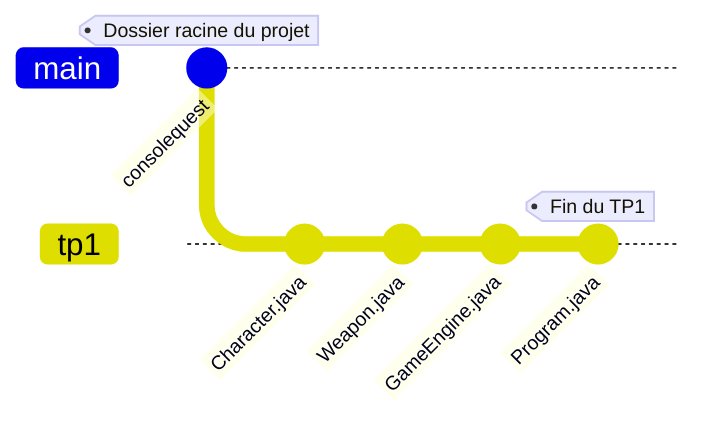
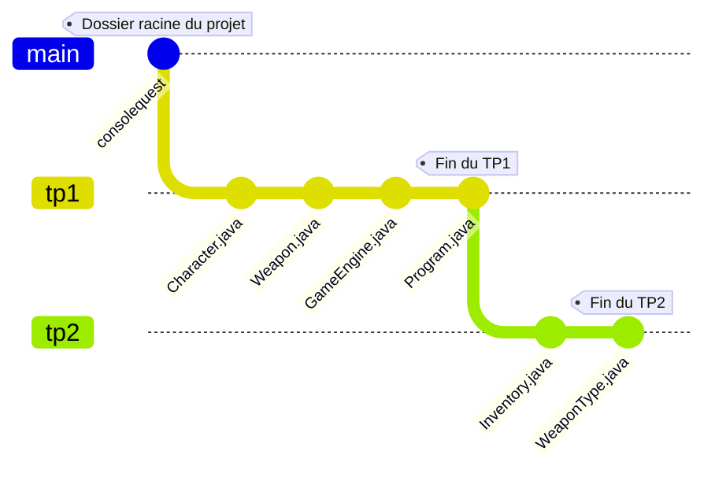

Enseignant: Abdoul Majid Thiombiano/[@thiomajid](https://github.com/thiomajid)

## Etape 1
Dans le dossier **ConsoleQuest** que nous avons créé lors du TP1, nous allons créer un dossier nommer **tp2** dans lequel nous allons mettre nos nouvelles classes.

Normalement la structure de votre projet devrait être comme suit depuis la dernière fois:




## Etape 2
Créer le fichier `Inventory.java` dans lequel nous allons définir la classe `Inventory` qui a la composition suivante:
- L'attribut privé `items` qui est une liste d'objets de type `Weapon`.

>[!Warning]
>L'attribut *items* doit être défini comme une constante de classe.

```java
// Pour utiliser les listes en Java, on procède comme suit:
// D'abord on importe la classe ArrayList

import java.util.ArrayList;

// On crée la liste avec le mot-clé new
ArrayList<SomeType> myList = new ArrayList<SomeType>();
```

- Un attribut privé constant de type `int` nommez `capacity` indiquant le nombre d'éléments **maximum** pouvant être contenus dans l'inventaire.
- Initialiser la liste `items` et l'attribut `capacity` dans le constructeur ci-dessous:

```java
public Inventory(int initialCapacity) {}
```

- La méthode **publique** `addItem` ajoute un nouvel élément à la liste `items`.

>[!Warning]
>Si l'inventaire est plein on n'ajoute pas l'objet à liste. Au lieu de cela on affichera le message: "*Vous n'avez plus d'espace libre dans votre inventaire*".


- Définir la méthode `findWeaponByName` qui retourne l'objet `Weapon` correspondant s'il existe dans la liste, sinon `null`.

```java
public Weapon findWeaponByName(String name) {
	// vos instructions
}
```

- Définir la méthode `deleteWeaponByName` qui prend en paramètre le nom d'un objet `Weapon` et le supprime de l'inventaire s'il existe, sinon affiche un message si l'élément correspondant n'a pas été trouvé.
- Un getter  pour l'attribut `items`.
- Définir la méthode `isFull` indiquant si l'inventaire est plein ou non.
- Définir la méthode `isEmpty` indiquant si l'inventaire est vide ou non.
- Redéfinir la méthode `toString` qui retourne les informations de l'inventaire sous la forme: `Inventory(capacity=<capacity>, items=[Weapon(name=<name_1>, attack=<attack_1>), Weapon(name=<name_2>, attack=<attack_2>)])`.

## Etape 3
Dans le fichier `WeaponType.java` créer l'énumération `WeaponType` ayant les valeurs suivantes: `SWORD, BOW, STAFF`.

Pour définir une énumération, on procède comme suit:
```java
public enum MyCustomEnumation {
	FIRST_VALUE,
	SECOND_VALUE,
	// etc...
}
```

## Etape 4
Dans la classe `Weapon`:
- On ajoutera l'attribut privé nommé `type` de type `WeaponType`.
- Définir un *getter* pour l'attribut *type*.
- Marquer tous les attributs de la classe comme étant des constantes.
- Supprimer toutes les méthodes *setter* de la classe *Weapon*.
- Définir un constructeur qui prend tous les paramètres nécessaires pour créer une instance de la classe *Weapon*.
- Redéfinir la méthode `equals` de la classe `Weapon` pour comparer deux objets `Weapon` en comparant sur le nom, l'attaque et le type de l'arme.

```java
@Override  
public boolean equals(Object obj) {
	// vos instructions
}
```

- Modifier la méthode `toString` pour inclure les informations du *type* de l'arme.
## Etape 5
Apportons des modifications à la classe `Character`.
- Ajouter un attribut *privé constant* de type `Inventory` nommé `inventory` qui sera initialisé avec une taille d'inventaire de votre choix (au minimum 3).
- Compléter les constructeurs suivants:
```java
public Character(String name, double health, double attack, double speed) {}

// Ce constructeur ajoute également l'arme passée en paramètre à l'inventaire du personnage
public Character(String name, double health, double attack, double speed, 
				 Weapon weapon) {}

public Character(String name, double health, double attack, double speed, 
				 String weaponName, double weaponAttack, WeaponType weaponType) {}
```

- Ajouter un attribut `characterId` de type `long` qui sera auto-incrémenter de 1 à chaque fois qu'on crée une nouvelle instance de la classe `Character`.

>[!Tip]
>Penser à utiliser un attribut **static** en plus de l'attribut *characterId*

- Modifier la méthode `equipWeapon` pour ajouter l'arme passée en paramètre à l'inventaire du personnage s'il ne l'a pas déjà.
- Définir la méthode `pickWeapon` qui permet d'ajouter une arme à l'inventaire du joueur.
- Définir la méthode une surchage de la méthode `equipWeapon` qui prend en paramètre le nom d'une arme et la cherche dans l'inventaire. Si elle existe alors le personnage va équiper cette arme. Egalement, son attaque va augmenter.

```java
public void equipWeapon(String weaponName) {}
```

- Définir la méthode `findWeaponByName` qui cherche dans l'inventaire du personnage l'objet `Weapon` correspondant et le retourne  s'il existe, sinon `null`.
- Définir la méthode `deleteWeaponByName` qui supprime de l'inventaire du personnage l'objet `Weapon` correspond s'il existe, sinon affiche un message si l'élément correspondant n'a pas été trouvé.
- Définir la méthode `manageInventory` qui va assurer la gestion de l'inventaire du personnage. On affichera le menu suivant:
	1. Ajouter un élément
	2. Supprimer un élément
	3. Chercher un élément
	4. Statut

>[!Tip]
>Lors de l'ajout d'un élément, on affichera le menu suivant pour choisir le type de l'arme:
>1. Sword
>2. Bow
>3. Staff

>[!Info]
>L'option de *recherche d'élément* affiche l'élément dans la console s'il existe, sinon on affichera un message d'erreur.
>
>Lorsque l'utilisateur choisira l'option *statut* alors on lui affichera tout l'inventaire du personnage.

- Modifier la méthode `toString` pour inclure les informations de l'inventaire du personnage.
## Etape 6
Dans la classe `GameEngine`, on ajoutera un nouvel attribut *privé* de type booléen `isRunning` permettant d'indiquer que le programme est en cours d'exécution. La valeur par défaut de *isRunning* est `false`.

On définira la méthode *privée* `exit` qui arrête l'exécution du programme et affiche un d'aurevoir.

Modifier la méthode `run` comme suit:
- D'abord le menu suivant sera affiché à l'utilisateur:
	- 1: Jouer
	- 2: Quitter
- S'il décide de quitter le jeu alors on lui affichera le message: "*A la prochaine sur ConsoleQuest*".
- Si l'utilisateur décide de jouer, alors on va lui créer un personnage dont il saisira toutes les informations nécessaires. L'utilisateur pourra créer un personnage avec une arme dès le début s'il le veut. 
- Après avoir créer son personnage, on affichera le menu suivant à l'utilisateur:
	- 1: Combattre
	- 2: Gestion d'inventaire
	- 3: Votre statut
	- 4: Quitter
- S'il choisit de combattre, on saisira les informations d'un autre personnage avec qui le combat sera fait. Si le personnage de l'utilisateur perd le combat, on affichera le message "*Game Over !*". Sinon le menu ci-dessus sera affiché encore.
- S'il choisit de gérer son inventaire alors on utilisera la méthode prédéfinit dans la classe `Character` pour répondre à cette demande.
- S'il choisit l'option *statut* alors on affichera dans la console les informations du personnage de l'utilisateur.
- S'il choisit de quitter le jeu, alors on arrête l'exécution du programme.

La structure devrait être comme suit à présent:




---
>Simplicity is the highest sophistication.
\- Leonardo Da Vinci
